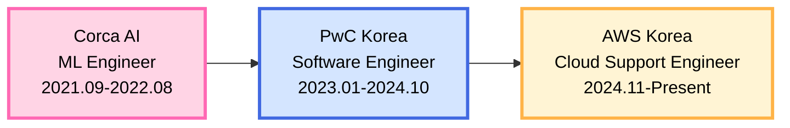

<div align="center">

# Hi there, I'm heyyzel 👋

[](https://git.io/typing-svg)

</div>

---

## 🚀 About Me

```typescript
const heyyzel = {
    role: "Cloud Support Engineer @ AWS Korea",
    mindset: "Problem-First, Technology-Second",
    superpower: "Rapid learning & adaptation",
    philosophy: "The best way to solve a problem is to understand it first"
};
```

I'm a **problem solver** who thrives on challenges. Rather than being confined to specific technologies, I quickly learn and adapt new tools to deliver solutions that matter.

## 💼 Experience Journey



| Company | Role | Period |
|---------|------|--------|
| 🟧 **AWS Korea** | Cloud Support Engineer | 2024.11 - Present |
| 🔵 **PwC Korea** | Software Engineer | 2023.01 - 2024.10 |
| 🟣 **Corca AI** | ML Engineer | 2021.09 - 2022.08 |

## 🎯 What Drives Me

<table>
<tr>
<td width="33%" align="center">

<h3>🔧 Rapid Learning</h3>
<p>Pick up new technologies fast and apply them effectively</p>
</td>
<td width="33%" align="center">

<h3>🎯 Problem-Focused</h3>
<p>Care about solving the right problems, not just writing code</p>
</td>
<td width="33%" align="center">

<h3>💡 Technology Agnostic</h3>
<p>The best tool is the one that solves the problem</p>
</td>
</tr>
</table>

## 📊 GitHub Stats

<div align="center">


</div>

## 🤝 Let's Connect

<div align="center">

[](https://github.com/heyyzel)
[](https://www.linkedin.com/in/soojin-an-2954a9250/)

**Open to interesting problems and collaboration opportunities!**

</div>

---

<div align="center">

### 💭 *"The best way to solve a problem is to understand it first."*


</div>
